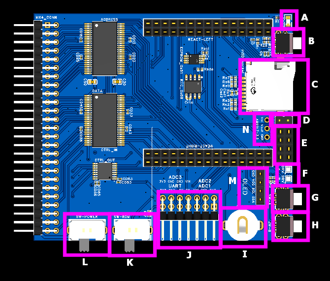
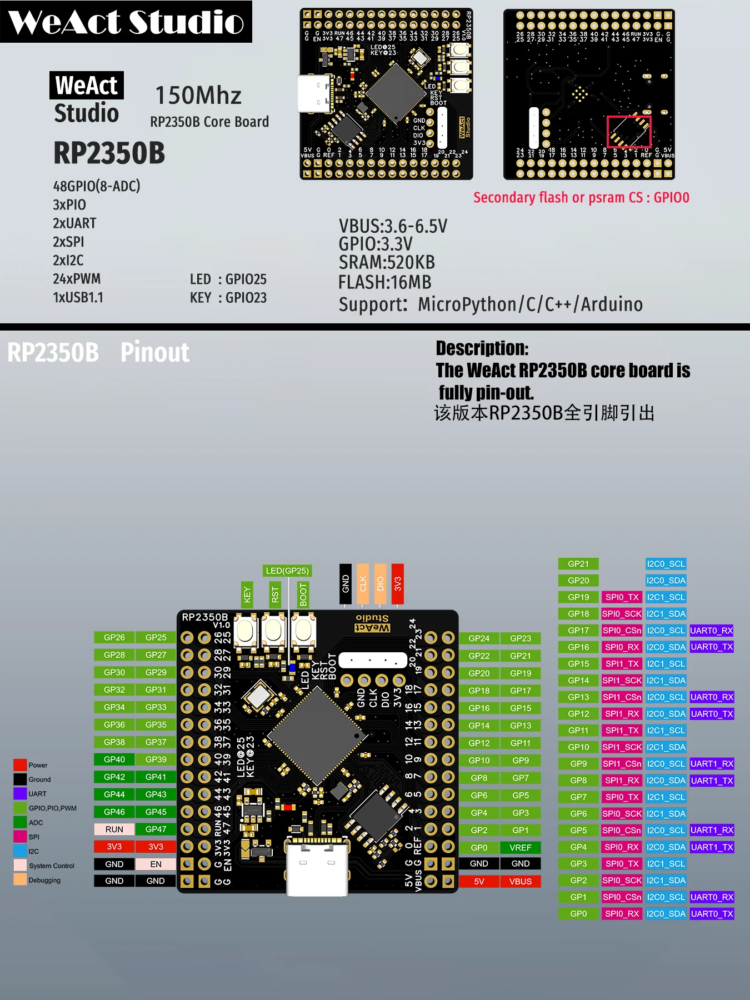
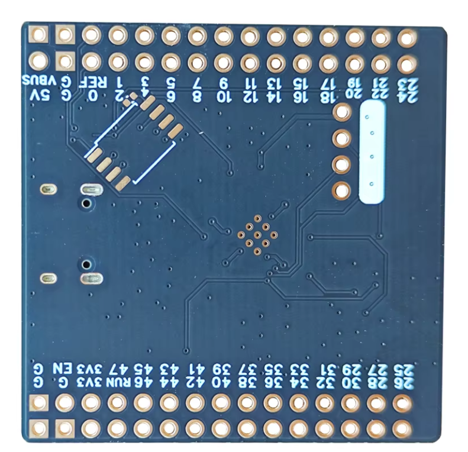
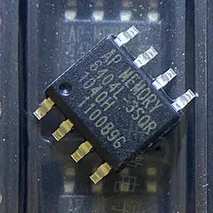
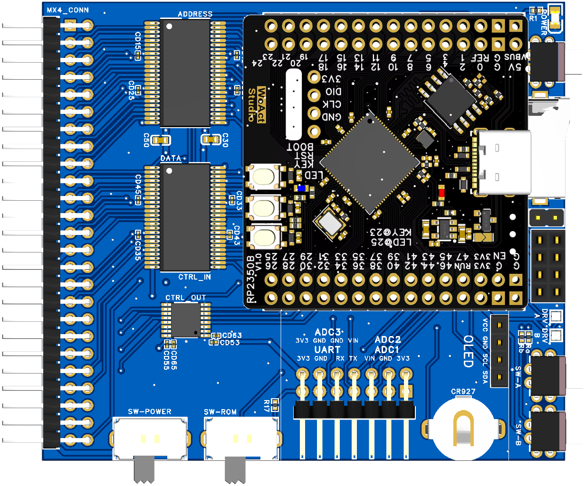
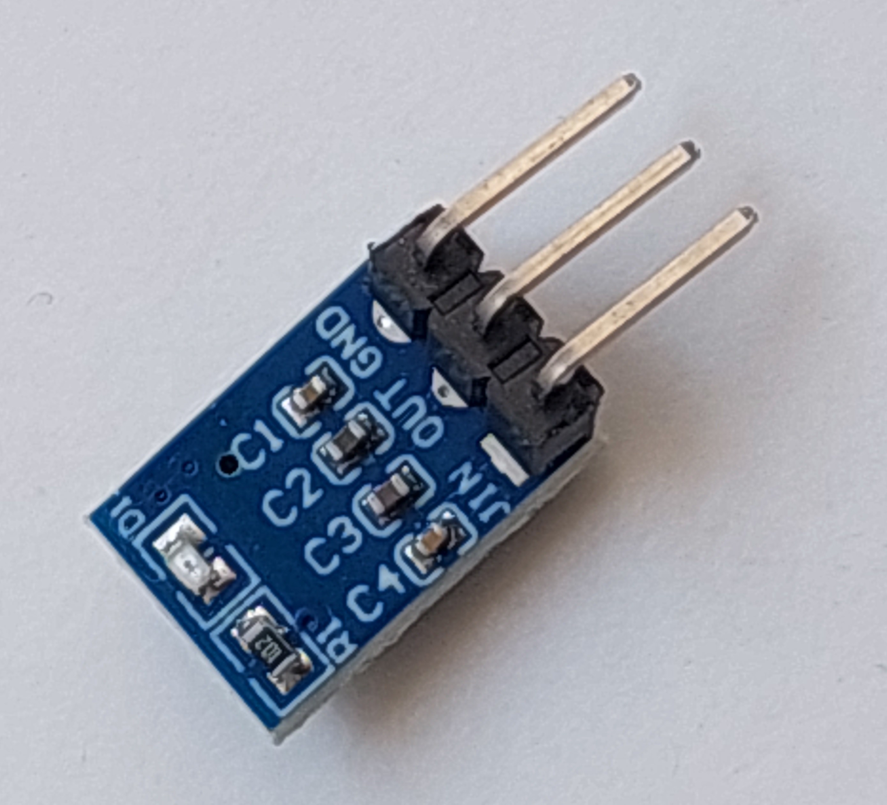
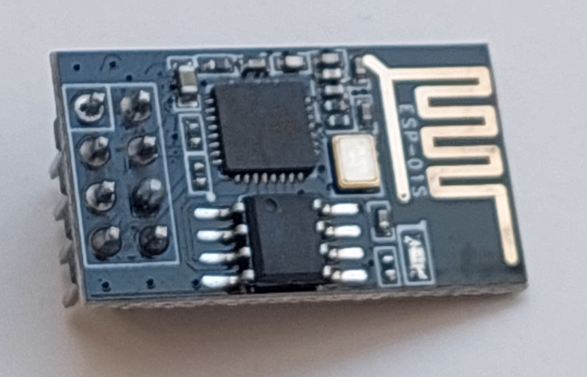
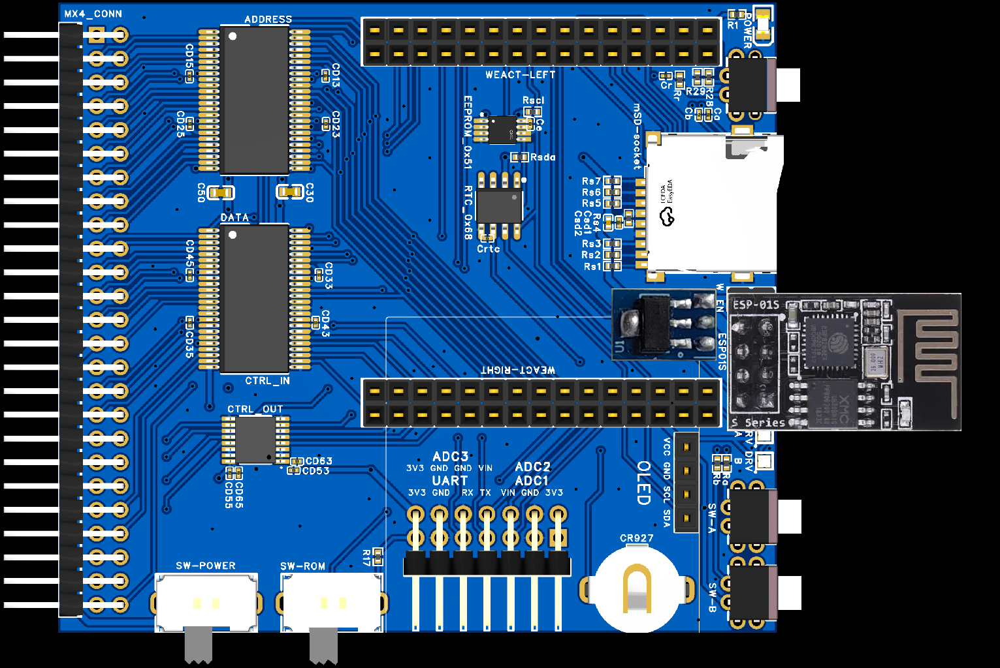
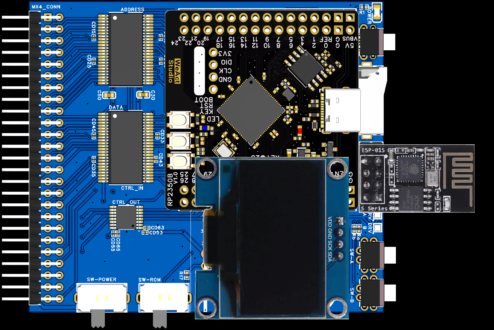

# GALEX 8i1  una expansión para AMSTRAD CPC

## Objetivos

- Desarrollar un proyecto de electrónica digital.

- Dotar al Amstrad CPC de carencias que hemos encontrado los usuarios a lo largo del tiempo, aunque algunas de ellas se podían obtener a precios altos.

1- **Almacenamiento masivo**. Actualmente es muy difícil o imposible encontrar discos de 3" y los pocos que hay resultan caros y poco fiables. 

2- **Memoria RAM**, para ejecutar software que requieren 128 Kb en el CPCC 464 y 664, y aquellos que hacen uso de memoria extendida más allá de los 128 Kb.

3- **Memoria ROM**, que añaden funcionalidad desde el momento que se enciende el ordenador, añadiendo compiladores, editores de texto, juegos, etc. Al estar en memoria el arranque es instantáneo.

4- **Puerto serie**.

Y como el microcontrolador a usar dispone de suficientes pines GPIO, añadimos:

5- Lectura de 3 **sensores analógicos**, ya que el microcontrolador lo permite.

6- Un módulo **RTC** para guardar la hora, por si en alguna aplicación resulta de interés (¿Symbos?). El RTC hace uso de una pila CR927 para mantener la hora que puede durar unos 4 años.

7- Un módulo de **EEPROM** (32 Kb) para guardar configuraciones, bien la propia expansión o el usuario del CPC. Esto ya es algo muy opcional. Se ha incluido porque resulta un componente muy barato.

- Una pantalla OLED de 0.96" o 1.3" para mostrar información, tanto en desarrollo/pruebas como finalmente al usuario. (opcional)

(Estas tres últimas del protocolo I2C por lo que sólo necesitan 2 pines GPIO)

8- Módulo **WIFI** (opcional) usando la placa ESP01s.

 

### Partes de la placa de interés

**A**: Led de encendido.

**B**: Botón de reset.

**C**: Slot para la tarjeta mSD.

**D**: Jumper para pasar corriente al regulador de tensión del módulo Wifi.

**E**: Conector para el módulo Wifi ESP01s.

**F**: Leds indicadores del estado de las disqueteras virtuales A y B:

- ROJO: no hay disco insertado.
- VERDE: hay disco insertado y desprotegido contra escritura.
- AZUL: hay disco insertado y protegido contra escritura.
Si están apagados es que no se están activas las disqueteras virtuales.

**G y H**: Botones para manipular las disqueteras y discos. El de arriba es para la unidad/disco A y el de abajo para el B. Con una pulsación corta se cambia de disco y con una pulsación larga se cambia la protección contra escritura.

**I**: Conector para la pila CR927.

**J**: Pines de conexión para la conexión serie y los sensores analógicos.

**K**: Switch para activar y desactivar la funcionalidad de ROM.

**L**: Switch para encender y apagar la expansión.

**M**: Conector para la pantalla OLED (de 0.96" o 1.3"). Hay que quitar las resistencias de este módulo.

**N**: Pads para soldar el regulador de tensión para el módulo Wifi.

 

## El microcontrolador

Se ha optado por el RP2350B en la placa de Weact porque expone todos los pines y porque se le puede añadir memoria.

Para emular la RAM y la ROM necesitamos más memoria RAM de la que trae el microcontrolador, ya que los 512 Kb de SRAM se consumirán con variables del programa y de las librerías que se utilicen. En el mejor de los casos, tendríamos 31 bancos de 16 Kb, que tendríamos que repartir entre la RAM y la ROM. Para empezar tampoco estaría mal una configuración con 8 bancos de ROM y 384 Kb de RAM (la RAM la añadimos en bloques de 64 Kb), pero realmente no sabemos cuánta memoria nos quedará libre.

Para disponer de más memoria soldamos un módulo PSRAM de 16 Mbit (=2 Mbytes) a la placa del RP2350B por la parte posterior, con lo que ganamos flexibilidad a la hora de configurar la memoria, por ejemplo:

- 1,5 MB de RAM y 32 ROMs
- 1,9 MG de RAM y 4 ROMs

<i>Placa WeAct vista por la parte de abajo</i>

<i>Chip de PSRAM</i>

<i>Weact en la placa principal</i>

 

## Módulo WIFI

Este módulo es totalmente opcional. El ESP01S se alimenta a 3.3V desde un regulador de tensión conectado directamente a la entrada de 5V. Como el regulador de tensión consume energía se dispone un jumper para pasarle corriente o no. La razón de usar un regulador es que la corriente que puede suministrar el microcontrolador a 3.3V es insuficiente.

<i>Regulador de voltaje</i>

<i>ESP01S</i>

Para colocar el regulador de voltaje se doblan las patillas hasta dejarlas rectas y se suelda de forma que la serigrafía queda mirando hacia abajo y el AMS1117 hacia arriba. No llega a molestar a la placa WeAct Studio.

<i>Regulador y ESP01S colocados</i>

 

## Pantalla OLED
Hay varios tamaños con distinto patillaje. El que usamos es VDD-GND-SCK-SDA. 

<i>Extensión completa</i>

Este módulo necesita pins más largos.

 

## Comandos RSX (no definitivo)

**|HD**  habilitar el almacenamiento masivo de la tarjeta mSD, que actuaría como si fuera un disco duro con la posibilidad de usar directorios

**|IDRIVE**  habilita la unidad de disco del CPC

**|DSK**  habilita la emulación de discos (ficheros .dsk)

### Comandos del Modo HD

**|CD**   cambiar de directorio

**|CPE,"origen","destino"**  copiar un fichero al disco emulado

**|CPF,"origen","destino"**  copiar un fichero al disco de la unidad

**|CP,"origen","destino"**  copiar un fichero al pendrive

**|MV,"origen","destino"**  cambiar ubicación de un fichero

**|RM,"fichero/directorio"**  borrar un fichero o directorio

**|TREE**  estructura de directorios

**|CATA**  CAT ampliado

### Comandos para la emulación de discos

(Un conjunto de discos es una selección de ficheros .dsk)

**|LSTA**  muestra los discos del conjunto A (disquetera A)

**|LSTB**  muestra los discos del conjunto B (disquetera B)

**|SETA**  establece los discos del conjunto A

**|SETB**  establece los discos del conjunto B

**|CLA**  borra el conjunto A

**|CLB**  borra el conjunto B

**|NEXTA**  siguiente disco del conjunto A

**|NEXTB**  siguiente disco del conjunto B

**|PROTA,1**   proteger disco A

**|PROTA,0**   desproteger disco A

**|PROTB,1**   proteger disco B

**|PROTB,0**   desproteger disco B

**|CP,"origen","destino"**  copiar un fichero

**|CPF,"origen","destino"**  copiar un fichero al disco de la unidad

**|CPH,"origen","destino"**  copiar un fichero al pendrive

### Comandos para discos reales

**|CP,"origen","destino"**  copiar un fichero

**|CPH,"origen","destino"**  copiar un fichero al pendrive

### Comandos de la expansión de ROM

**|ROM,slot,"fichero.rom"**  establece una rom en un slot

**|ROM,slot**  quita la rom del slot

**|ROMLST**  muestra las roms instaladas

Usar el slot 255 para referirse a la LOWER ROM.

### Comandos para configurar la RAM

**|RAM,bloques-de-64k**  establece los bloques extra de 64 Kbytes

**|RAM**  muestra la cantidad de RAM de la expansión

### Otros Comandos

**|BURNDSK,"fichero.dsk","unidad"**  copia un fichero .dsk en un disco fisico, unidad=A|B

**|GETDSK,"unidad","fichero.dsk"**  crea una imagen del disco y la graba como fichero

### Comandos del módulo RTC

**|DATE**  Devuelve la fecha en formato yyyy-mm-dd

**|DATE,"y-m-d"**  Establece la fecha

**|TIME**  Devuelve la hora en formato hh:mm:ss (24h)

**|SETTIME,"h:m:s"**  Establece la hora

### Comandos del módulo de EEPROM

**|EEPROM,direccion,byte**  guardar un byte en la dirección indicada

**|EEPROM,direccion**   leer el byte de la dirección indicada

### Comandos del módulo WIFI

**|PING,"ip-o-hostname"**  hace un ping
**|WLAN**  busca las WLAN a las que se puede conectar
**|WIFI,"ssid","contraseña"**  configuracion wifi con DHCP
**|WIFI,"ssid","contraseña","ip","mascara","gw","dns1","dns2"**  config wifi IP estática
**|WGET,"url","fichero"**  descargar un fichero de internet

### Comandos para la comunicación serie

**|SERIAL,"parametros-comunicacion-serie**  configurar comunicacion serie
Con instrucciones OUT e IN se enviarán y recibirán los bytes.

### Comandos de los sensores analógicos

**|ADC,num-sensor**  obtener un valor de 8 bitns del ADC seleccionado (sensor=1..3)
